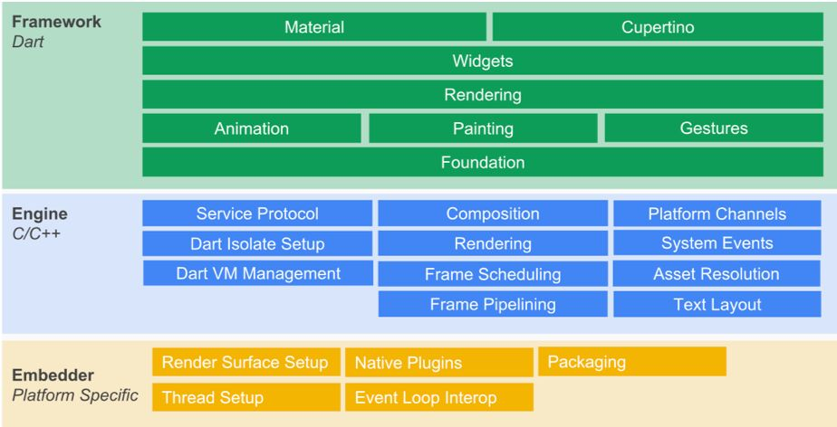
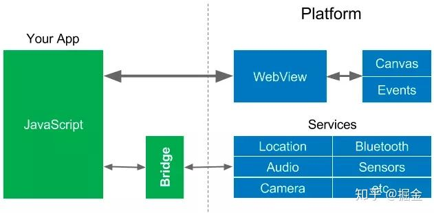
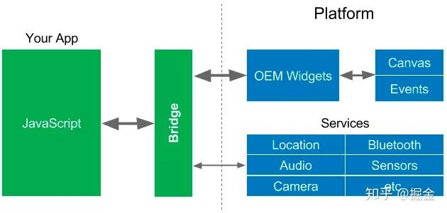
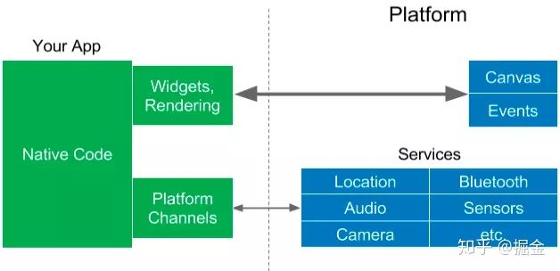
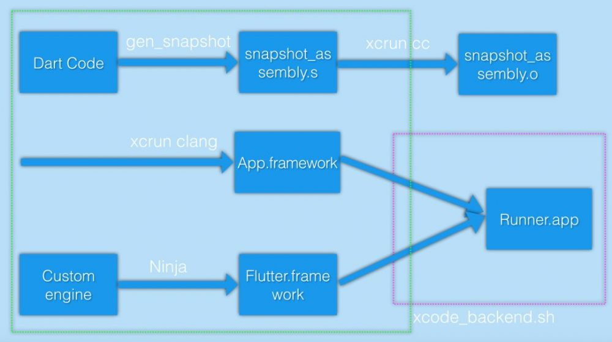

#### Flutter 框架简介：


上图，是Flutter的整体框架，我们可以看出Flutter的整体框架是有三部分组成：
* Framework：最上层是Flutter提供的两种风格的Widget(Material和Cupertino)，往下是Widget层；接着是渲染、动画、手势等。
* Engine：主要是给Framework层提供支持，包括Skia(二维图形库)、Dart（Dart runtime,GC垃圾回收等）、Text（文本渲染）。
* Embedder：嵌入层，即把Flutter嵌入到各个平台上去。
从这些层级其实也可以看出，**Flutter的平台相关性很低，平台只提供画布，剩余所有的渲染相关都在Flutter内部，所以它天生就有很好的跨平台特性**。
	* Widget：类似于iOS的UIView的作用，Flutter几乎所有对象都是Widget，它实际上也不是真正显示在屏幕上的元素，而只是“描述UI元素额配置数据”，真正显示屏幕的元素是Element。具体可以查看 [我的blog](https://fcf5646448.github.io/2019/02/20/Flutter02/)
	* Flutter的大致渲染流程：当UI需要更新时，Framework会通知Engine，Engine会等到下一个VSync信号到达时，通知Framework，然后Framework会进行对应的animations、build、layout、compositing、paint,最后生成layer提交给Engine。Engine会把layer进行组合，生成纹理，最后通过OpenGL接口提交给GPU，GPU经过处理后在显示器上显示出来。


此时，我们来对比一下近些年出现的跨平台方案：

* webview：WebView的优点就是可以完全继承现代web开发的成果(丰富的控件、各种页面框架、动态化)。但是WebView有一个致命的缺点就是它的渲染效率和JavaScript的执行性能问题。加上各个系统版本和设备厂商的订制，很难保证在所有设备上能够提供一致的体验；
  

* React Native：为了解决WebView的渲染性能问题，RN将最终的渲染工作交还给了系统。虽然同样使用HTML+JS的UI构建逻辑，但是最终会生成对应的自定义原生控件，以充分利用原生控件对WebView的较高的绘制效率。但是这种策略也将框架本身与APP开发者绑在了系统的控件上，不仅框架本身需要处理大量平台相关逻辑，开发过程中也要处理不同平台的差异。另外JavaScript访问Native必须通过Bridge，访问频率非常高(尤其是动画或者滚动时，每秒可达60次)。因此也可能导致性能问题。
  

* Flutter：Flutter则使用编译的编程语言Dart来避免Bridge引起的性能问题。Dart被提前编译成多个平台的本地代码。如上文所述，它将Widget和渲染器从平台移到应用程序中，从而使其可以自定义和扩展。Flutter对平台的需求只是一个画布，Widget可以呈现在设备屏幕上，并可以访问事件(触摸、定时器)和服务(位置、摄像机等)
	

#### Flutter与iOS原生混合编程
在整合进混编项目之前，先来理解一下Flutter的编译和运行流程(主要讲release模式下)。
##### Flutter编译流程

大致流程就是所有的Dart代码通过gen_snaphot生成了汇编形式的机器代码，然后再通过xcrun的编译工具链生成最终的App.framework。同时呢，Engine和Embedder部分会通过Ninja构建成Flutter.framwork。

##### Flutter运行流程


#####  原生项目中使用cocoapod集成Flutter。
从上文可以看到Flutter编译完成后是一个Framework，所以在原生框架中使用的话，也是只需使用它的Framework就好了。
大概流程步骤：
* 1、通过cocoapod，导入已经存在的Flutter module
```podfile
# 这里写你的flutter module相对路径
flutter_application_path = '../flutter_module/'
target 'FluNative' do
# Comment the next line if you're not using Swift and don't want to use dynamic frameworks
use_frameworks!
  
# Pods for FluNative
eval(File.read(File.join(flutter_application_path, '.ios', 'Flutter', 'podhelper.rb')),binding)
```
* 2、添加脚本
```js
# 删除本地Flutter文件夹
rm -rf -- "$SOURCE_ROOT/Flutter"
# 再生成Flutter文件夹
mkdir -p "$SOURCE_ROOT/Flutter"
# 编译生成
"$FLUTTER_ROOT/packages/flutter_tools/bin/xcode_backend.sh" 	build
# 将胶水文件copy到本地文件夹
cp -r -- "$FLUTTER_APPLICATION_PATH/.ios/Flutter/flutter_assets" "​$SOURCE_ROOT/Flutter"
cp -r -- "$FLUTTER_APPLICATION_PATH/.ios/Flutter/App.framework" "​$SOURCE_ROOT/Flutter"
```
* 3、common + B build之后，会在项目文件夹下生成一个Flutter的文件夹，里面放置的是上文说到的 App.framework。将其add进来就可以使用了。

* 4、修改Appdelegate
```swift
import UIKit
import Flutter
@UIApplicationMain
class AppDelegate: FlutterAppDelegate {
   override func application(_ application: UIApplication, didFinishLaunchingWithOptions launchOptions: [UIApplication.LaunchOptionsKey: Any]?) -> Bool {
        return super.application(application, didFinishLaunchingWithOptions: launchOptions)
    }
}
```
* 5、使用
```swift
@IBAction func pushFlutterAction(_ sender: Any) {
	let vc = FlutterViewController() 
	self.navigationController?.pushViewController(vc, animated: true)
}
```

##### Flutter与原生通信
Flutter提供了一个Platform Channel机制，让消息能够在native与Flutter之间进行传递。
BasicMessageChannel：用于传递基础数据
MethodChannel：Flutter调用native侧功能
EventChannel：native调用Flutter功能
大概的流程就是：首先初始化一个桥接，传入桥接名和处理消息发送接收的类（但是其实最终响应的类可以根据路由订制）。然后通过一个MessageHandle监听消息回调，同时可以向flutter侧回传执行结果。

Native侧：

```swift
let flutter = FlutterViewController()
        flutter.hidesBottomBarWhenPushed = true
        
        flutter.setInitialRoute("myApp")
        let methodChannel:FlutterMethodChannel = FlutterMethodChannel(name: "com.pages.your/native_get", binaryMessenger: flutter)
        
        methodChannel.setMethodCallHandler {[weak self] (call, result) in
            guard let `self` = self else {return}
            /*
             *
             */
            print("method:\(call.method);narguments:\(String(describing: call.arguments))")
            
            if "iOSFlutter" == call.method {
                
                let target = TargetViewController()
                self.navigationController?.pushViewController(target, animated: true)
            }else if "iOSFlutter1" == call.method {
                if let dic = call.arguments as? [NSString:Any] {
                    print("code:\(dic["code"] ?? "-1")")
                    print("data:\(dic["data"] ?? "-1")")
                }
            }else if "iOSFlutter2" == call.method {
                let batterylevel = self.getBatteryLevel()
                if batterylevel == -1 {
                    result(FlutterError(code: "UNAvailable", message: "battery info unavailabel", details: nil))
                }else{
                    result("\(batterylevel)")
                }
            }
            
        }
```
Flutter侧：
```Dart
class _MyHomePageState extends State<MyHomePage> {
  
  static const methodChannel = const MethodChannel('com.pages.your/native_get');

  _iOSPushToVC() async {
    await methodChannel.invokeMethod('iOSFlutter', '参数');
  }

  _iOSPushToVC1() async {
    Map<String, dynamic> map = {"code": "200", "data":[1,2,3]};
    await methodChannel.invokeMethod('iOSFlutter1', map);
  }

  _iOSPushToVC2() async {
    dynamic result;
    try {
      result = await methodChannel.invokeMethod('iOSFlutter2');
    } on PlatformException {
      result = "error";
    }
    if (result is String) {
      print(result);
      showModalBottomSheet(context: context, builder: (BuildContext context) {
        return new Container(
          child: new Center(
            child: new Text(result, style: new TextStyle(color: Colors.brown), textAlign: TextAlign.center,),
          ),
          height: 40.0,
        );
      });
    }
  }

  @override
  Widget build(BuildContext context) {
    return Scaffold(
      body: Center(
        child: Column(
          mainAxisAlignment: MainAxisAlignment.center,
          children: <Widget>[
            new FlatButton(onPressed: (){
              _iOSPushToVC();
            }, child: new Text("跳转iOS新界面，参数是字符串")),
            new FlatButton(onPressed: (){
              _iOSPushToVC1();
            }, child: Text('传参，参数是map，看log')),
            new FlatButton(onPressed: () {
              _iOSPushToVC2();
            }, child: new Text("接收客户端相关内容")),
          ],
        ),
      ),
    );
  }
}
```


